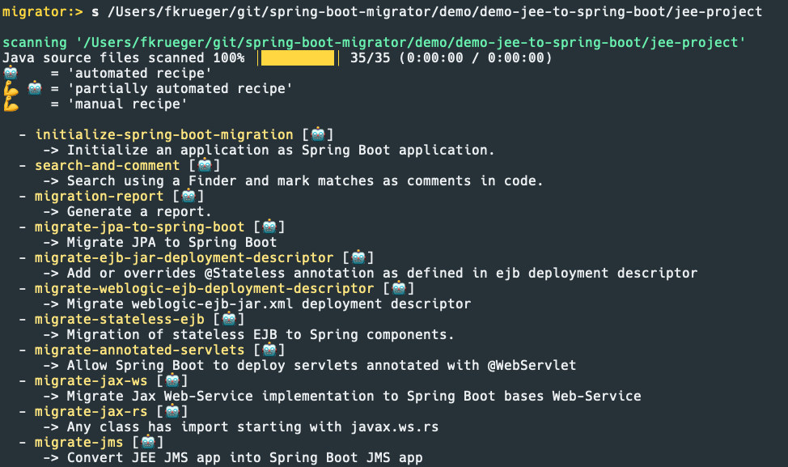
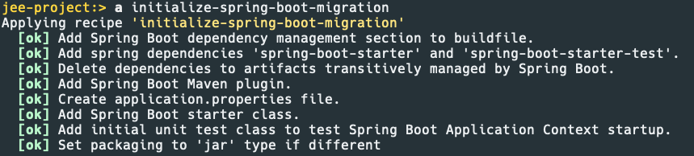

= Spring Boot Migrator (SBM)

image:https://img.shields.io/github/license/spring-projects-experimental/spring-boot-migrator[GitHub]
image:https://img.shields.io/github/v/release/spring-projects-experimental/spring-boot-migrator[GitHub release (latest by date)]
image:https://img.shields.io/github/downloads/spring-projects-experimental/spring-boot-migrator/0.13.0/total[GitHub release (latest by date)]
image:https://img.shields.io/youtube/channel/views/UC6NuSiwpvI32YTcdIflObPQ?logo=youtube&style=flat-square[YouTube Channel Views]

image:https://img.shields.io/badge/Join-Slack-green?logo=slack&color=007EC6&style=for-the-badge[link="https://join.slack.com/t/springbootmigrator/shared_invite/zt-1k6yxfi3b-MEQ_MM67qXufWtc~Tw6y9w"]
image:https://img.shields.io/github/discussions/spring-projects-experimental/spring-boot-migrator?label=GitHub%20discussions&logo=GitHUb&style=for-the-badge[GitHub Discussions]
image:https://img.shields.io/gitter/room/spring-boot-migrator/community?color=007EC6&logo=gitter&style=for-the-badge[link="https://gitter.im/spring-boot-migrator/community"]

[quote]
____
Spring Boot Migrator (SBM) aims to help developers upgrade or migrate to https://spring.io/projects/spring-boot[Spring Boot] by providing recipes for automated migrations.
____

== Support and Requirements

✅ Java, JDK 17
✅ Maven
❌ Kotlin
❌ Gradle

== Spring Boot 3.0 Upgrade - Interactive Web UI
We are working on automated upgrade from Spring Boot 2.7 to Spring Boot 3.0.

Click the image to watch a demo video [2:26]

ifdef::env-github[]
image:https://img.youtube.com/vi/RKXblzn8lFg/maxresdefault.jpg[link=https://www.youtube.com/embed/RKXblzn8lFg]
endif::[]

=== Try the Spring Boot Upgrade Tool
NOTE: **Use JDK 17**

. Download the https://github.com/spring-projects-experimental/spring-boot-migrator/releases/download/latest/spring-boot-upgrade.jar[spring-boot-upgrade.jar]
. Run `java -jar --add-opens java.base/sun.nio.ch=ALL-UNNAMED --add-opens java.base/java.io=ALL-UNNAMED spring-boot-upgrade.jar <path-to-application>`

If any of your applications is on 2.7 and uses Maven (Gradle is currently not supported), we'd be happy if you
could give SBM a try and provide feedback of how it worked out.
It is very hard to come up with all the possible setups found in the wild and therefor we need you - the community - to provide feedback to stabilize the recipe.

Thank you!

=== Contributing
Any contribution is appreciated!
If you want to get involved, please have a look at https://github.com/spring-projects-experimental/spring-boot-migrator/wiki/Spring-Boot-3-Upgrade-Report-Contribution-Guideline[Spring Boot 3 Upgrade Report Contribution Guideline] where we provide information related to contributing to the Spring Boot 3 Upgrade.
Please don't hesitate to ask questions and provide feedback.

Find the list of Spring Boot 3 Upgrade related issues labeled as `good first issue` https://github.com/spring-projects-experimental/spring-boot-migrator/issues?q=is%3Aissue+is%3Aopen+label%3A3.0.0+label%3A%22good+first+issue%22+[here]

If you decided you want to work on an issue, leave a comment letting us know that you want to work on it and we go from there.

Thank you!

== JEE to Spring Boot Migration
Spring Boot Migrator offers recipes to migrate JEE applications to Spring Boot.

These specifications are covered (to some extent and varying completeness)

* Servlet
* JAX-RS
* SOAP
* JMS
* EJB
* JPA
* ejb-jar.xml
* weblogic-ejb-jar.xml

Click the image to watch a demo video [16:57]

ifdef::env-github[]
image:https://img.youtube.com/vi/PnvsLafekWE/maxresdefault.jpg[link=https://www.youtube.com/embed/PnvsLafekWE]
endif::[]

== How SBM works

Spring Boot Migrator uses and is compatible with https://github.com/openrewrite/rewrite[OpenRewrite,window=_blank],
a powerful mass refactoring ecosystem for Java and other source code.

Spring Boot Migrator offers a CLI to run recipes to migrate or upgrade a given application to Spring Boot.
For developing new and custom recipes, SBM provides an opinionated API compatible with OpenRewrite recipes
and a set of specialized resource representations to simplify recipe development for Spring Boot.

=== Scan application
A given codebase is scanned and a set of recipes gets evaluated against the codebase. +

=== Apply a recipe
The list of applicable recipes is displayed and recipes can be selected from the list to be run against the codebase. +
The recipes either apply automated migrations or guide users on their migration journey.

== Spring Boot 3.0 Migrator - Java CLI

* Download the latest release from here: https://github.com/spring-projects-experimental/spring-boot-migrator/releases/latest[Spring Boot Migrator Releases]
* Start the application: `java -jar spring-boot-migrator.jar`
* In the CLI start by scanning the application `scan <path-to-application>`
* From the list of applicable recipes select the one you want to apply, +
e.g.: `apply initialize-spring-boot-migration` +
Spring Boot Migrator will now apply the migrations defined in the recipe to the codebase.
* To get help when using SBM use the `help` command

NOTE: When using Windows you must either escape `\` or use `/` as path separator, e.g. `C:\\my\\app` or `C:/my/app`

NOTE: **SBM requires a JDK 17.**

=== Building from source
* Clone the repository
* Change into root dir
* Run `mvn clean install`
* Find the jar in `applications/spring-shell/spring-boot-migrator.jar`

WARNING: **Some integration tests use Docker so you'll need Docker to run them. +
You can pass the `-DskipTests` flag to the `mvn` command to ignore tests.**

== Documentation

- https://spring-projects-experimental.github.io/spring-boot-migrator/user-documentation.html[User documentation,window=_blank]
- https://spring-projects-experimental.github.io/spring-boot-migrator/developer-documentation.html[Developer documentation,window=_blank]

== Contributing

If you have not previously done so, please sign the https://cla.pivotal.io/sign/spring[Contributor License Agreement]. You will be reminded automatically when you submit the pull request.

All contributions are welcome.

Please refer to the link:CONTRIBUTING.adoc[] for more details.

**This project requires Java 17.**

== License

https://www.apache.org/licenses/LICENSE-2.0[Apache License v2.0]

