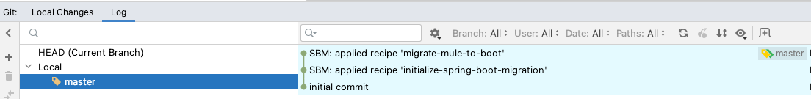
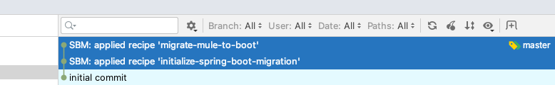
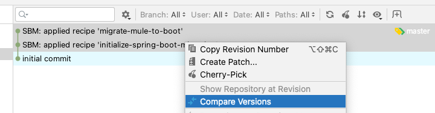
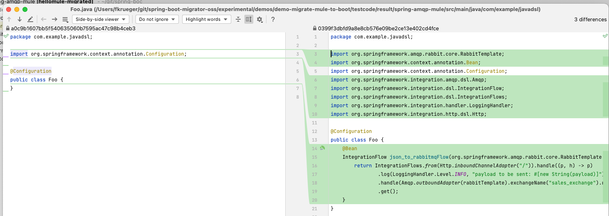

= Migrate Mule 3.9 to Spring Integration

== Introduction

This demo shows how SBM can be used to migrate a https://docs.mulesoft.com/release-notes/mule-runtime/mule-3.9.0-release-notes[Mule 3.9]
application to Spring Integration by applying recipe `migrate-mule-to-boot`.

=== Requirements

The demo was created on Mac OS but should run under Windows with a shell too.

- JDK 11
- Maven
- Docker
- IntelliJ (can be changed)

== The Demo

A Mulesoft application with one flow using `http:listener` and `amqp:outbound-endpoint` gets migrated to Spring Integration.
The migrated application provides a REST endpoint that sends a message received as POST request to a RabbitMQ queue.

=== Run the demo

* Call the `run-demo.sh` shell script to ru the full demo +
  `./run-demo.sh`

The script

* Moves all resources from `testcode/given`
* Initializes Git repository in the project to migrate
* Uses `docker-compose` to start a RabbitMQ instance with `sales_queue` configured
* Waits, and proceeds on `enter`
* Runs the migration by applying the commands in `commands.txt` (`initalize-spring-boot-migration`, `migrate-mule-to-boot`)
* Opens IntelliJ IDEA +
Under `Git/Log` in IntelliJ you should be able to find the commits for the applied recipes and compare the applied changes.

You can select the commits to compare

* Builds the migrated application +
You'll need to exit the application manually using `Ctrl + c` as the `exit` is currently broken (v0.10.0)
* Waits, and proceeds on `enter`
* Starts the migrated application +
The application is started in the background and console output can be found in `./application.log`
* Find the URL for the RabbitMQ console in console output, verify no message exists
* Waits, and proceeds on `enter`
* Sends a message to the REST endpoint +
`curl --location --request POST 'http://localhost:8081/' --header 'Content-Type: text/plain' --data-raw '{"hello": "from mule spring world"}'`
* Waits, and proceeds on `enter`, this lets you verify one message was sent
* The message can be checked in the http://localhost:15672/#/queues/%2F/sales_queue[RabbiMQ console] +
**You might have to refresh the browser few times (or wait few seconds)**
* Waits, and proceeds on `enter`
* shuts down the application
* performs clean up